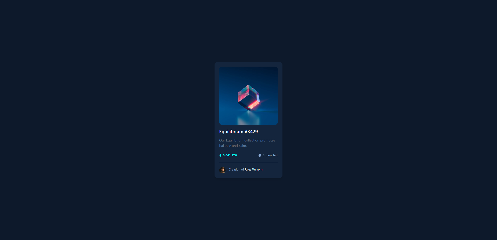
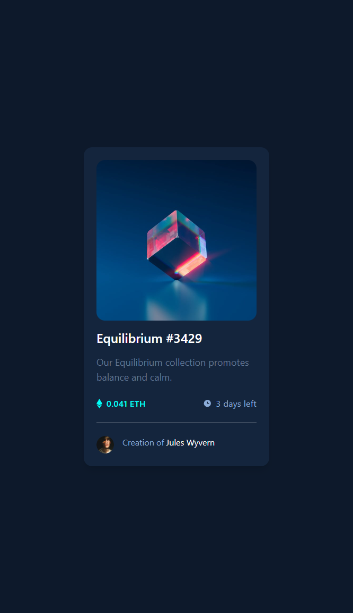

# Frontend Mentor - NFT preview card component solution

This is a solution to the [NFT preview card component challenge on Frontend Mentor](https://www.frontendmentor.io/challenges/nft-preview-card-component-SbdUL_w0U). Frontend Mentor challenges help you improve your coding skills by building realistic projects.

## Table of contents

- [Overview](#overview)
- [Screenshot](#screenshot)
- [Links](#links)
- [Built with](#built-with)
- [Author](#author)

## Overview

Frontend Mentor Challenge for Creating a NFT preview card component with Responsiveness to all devices.

### Screenshot

## 1 Web View

## 2 Mobile View

### Links

- Solution URL: [GIT Repository](https://github.com/hieuvominh/nft-preview-card-component)

- Live Site URL: [Preview]()

### Built with

- HTML5

- Tailwindcss

## Author

- Frontend Mentor - [@hieuvominh](https://www.frontendmentor.io/profile/hieuvominh)
